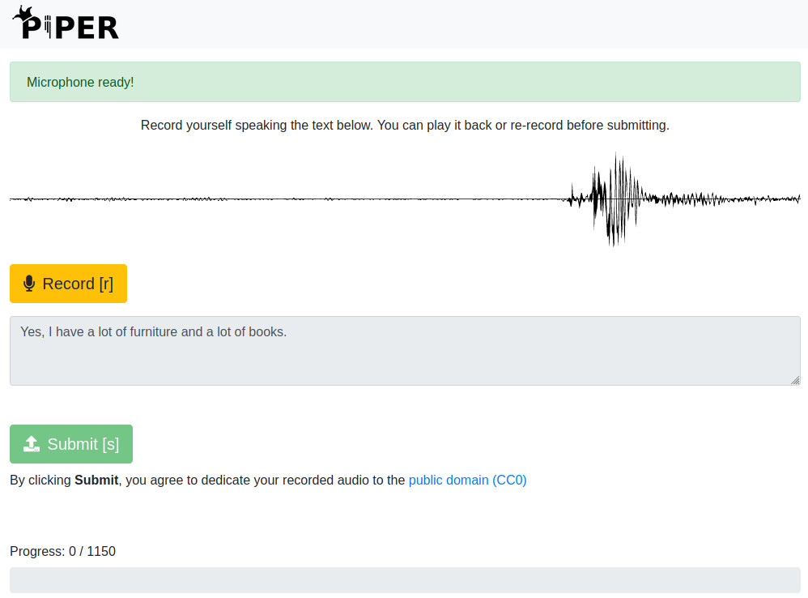

# Piper Voice Helper

Record yourself and train a [Piper text to speech](https://github.com/OHF-Voice/piper1-gpl) voice from the same web UI.

Based on [Piper Recording Studio](https://github.com/rhasspy/piper-recording-studio) by Michael Hansen (MIT), with an added **Train Voice** button.



[](https://nabucasa.com)


## Tutorial

See a [video tutorial](https://www.youtube.com/watch?v=Z1pptxLT_3I) by [Thorsten Müller](https://www.thorsten-voice.de/)


## Docker

``` sh
docker run -it -p 8000:8000 -v '/path/to/output:/app/output' rhasspy/piper-recording-studio
```

Visit http://localhost:8000 to select a language and start recording.

Add `--help` to see more options.


### Building

``` sh
docker build . -t rhasspy/piper-recording-studio
```


## Installing without Docker

``` sh
git clone https://github.com/rhasspy/piper-recording-studio.git
cd piper-recording-studio/

python3 -m venv .venv
source .venv/bin/activate
python3 -m pip install --upgrade pip
python3 -m pip install -r requirements.txt
```


## Running without Docker

``` sh
python3 -m piper_recording_studio
```

Visit http://localhost:8000 to select a language and start recording.

Prompts are in the `prompts/` directory with the following format:

* Language directories are named `<language name>_<language code>`
* Each `.txt` in a language directory contains lines with:
    * `<id>\t<text>` or
    * `text` (id is automatically assigned based on line number)

Output audio is written to `output/`

See `--debug` for more options.


## Exporting

Install ffmpeg:

``` sh
sudo apt-get install ffmpeg
```

Install exporting dependencies:

``` sh
python3 -m pip install -r requirements_export.txt
```

Export recordings for a language to a Piper-compatible dataset (LJSpeech format):

``` sh
python3 -m export_dataset output/<language>/ /path/to/dataset
```

Requires a non-Docker install. If you used Docker to record your dataset, you may need to adjust the permissions of the output directory:

``` sh
sudo chown -R "$(id -u):$(id -u)" output/
```

See `--help` for more options. You may need to adjust the silence detection parameters to correctly remove button clicks and keypresses.


## Training

Pick a language on the home page (or finish recording) and click **Train Voice**. The training page runs, in the background:

1. Export your recordings to an LJSpeech dataset (same as `python3 -m export_dataset`, so install `ffmpeg` and `requirements_export.txt`)
2. Download the base checkpoint if a URL was given (cached in `output/_training/checkpoints/`)
3. Fine-tune with Piper
4. Export the latest checkpoint to `<lang>-<name>-medium.onnx` + `.onnx.json`, downloadable from the page

Work files and `train.log` go to `output/_training/<language>/`. Only one job runs at a time; **Stop** interrupts it.

Piper training itself must be installed separately (it needs PyTorch, and a GPU is strongly recommended). Point the studio at the Python interpreter that has it:

``` sh
# OHF-Voice/piper1-gpl (default): pip install -e '.[train]' in a piper1-gpl clone
python3 -m piper_recording_studio --train-python /path/to/piper1-gpl/.venv/bin/python3

# rhasspy/piper (piper_train)
python3 -m piper_recording_studio --train-backend legacy --train-python /path/to/piper/src/python/.venv/bin/python3
```

Fine-tuning from a medium-quality [checkpoint](https://huggingface.co/datasets/rhasspy/piper-checkpoints/tree/main) is highly recommended (the lessac `en_US` one is pre-filled; change it with `--default-checkpoint`). "Epochs" are added on top of the checkpoint's epoch number, which is read from its `epoch=N` file name. Training is not available in the Docker image.


## Multi-User Mode

``` sh
python3 -m piper_recording_studio --multi-user
```

Now a "login code" will be required to record. A directory `output/user_<code>/<language>` must exist for each user and language.
